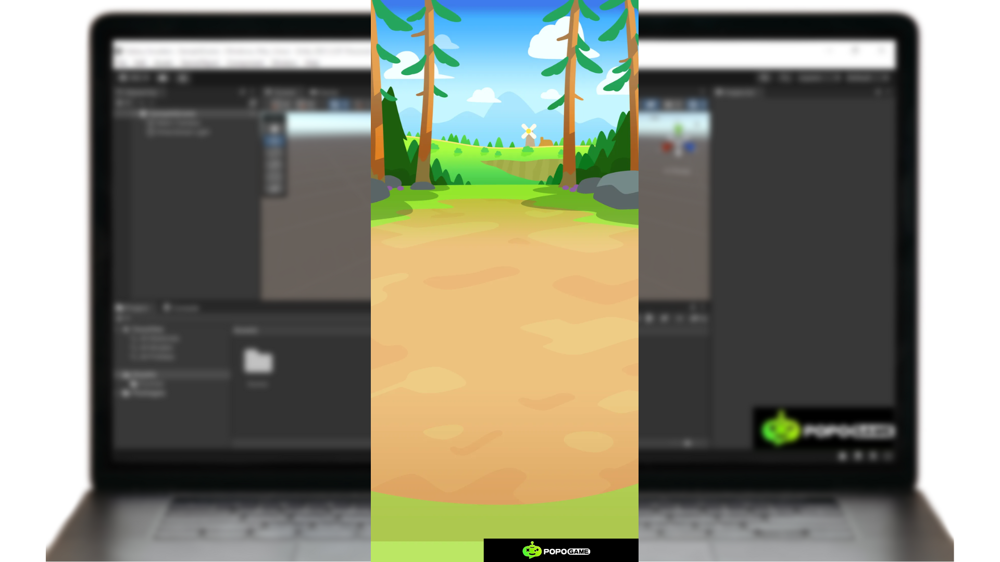

# Learning Mini-Game Development from Scratch: An Introduction to the Unity Editor

Today, let's take a preliminary look at the Unity editor interface and create and run the first project.

## Unity Editor Interface

The Unity editor interface consists of multiple windows and panels, each with a specific function. Familiarizing yourself with these interface components will help you work more efficiently in development.

## Project View

It is your main window for managing and browsing project resources. All resources imported into Unity, such as scripts, materials, audio files, and prefabs, can be found in the project view. The project view is typically located in the lower-left corner of the editor window and provides a convenient way to organize resources by folder.

From the project view, you can create new folders, import resources, delete unnecessary files, and drag and drop between project resources. You can also quickly access common operations such as creating new scripts and materials through the right-click menu.

## Scene View

It is the main window used to build and edit game scenes. It provides a 3D or 2D view, allowing you to view and manipulate objects in the scene freely. The scene view is typically positioned in the centre of the editor window, offering a rich set of tools and options to help you construct the game world.

In the scene view, you can use the move, rotate, and scale tools on the toolbar to adjust the object's position, orientation, and size. You can also quickly navigate the scene using keyboard shortcuts and mouse actions, such as holding down the right mouse button and dragging to rotate the view, and using the scroll wheel to zoom in or out.

## Hierarchy View

It shows the hierarchy of all objects in the current scene. It is usually located in the upper left corner of the editor window, listing all game objects in the scene and displaying their parent-child relationships in a tree structure.

In the hierarchical view, you can rearrange objects by dragging and dropping, creating parent-child relationships. Right-click on an object allows you to access a context menu from which you can perform various actions such as renaming, copying, deleting, or creating new child objects. The hierarchical view is an important tool for managing object relationships in a scene.

## Inspector View

The Inspector View displays the details and properties of the currently selected object. It is typically located on the right side of the editor window and provides comprehensive control over the components and properties of the object. Each game object consists of multiple components, such as the Transform component, Renderer component, and Collider component, and the properties of these components can be viewed and edited in Inspector View.

Through the inspector view, you can modify various properties of the object, such as adjusting its position, rotation angle, material colour, and more. You can also add or remove components to customize the object's behaviour and appearance.

## Game View

The Game View provides a real-time preview window that shows what the game looks like while running. It is usually located in the centre of the editor window, sharing space with the Scene View. You can switch between Scene View and Game View by toggling the views.

In the game view, you can run and test the game to see its actual effects. By using the play, pause, and stop buttons on the control panel, you can control the game's running state, which is convenient for debugging and testing.

## Control Panel

The control panel is located at the top of the editor window and provides global control over the project and scene. It contains play, pause, and stop buttons, as well as other commonly used tools and options such as saving the scene, switching view modes, and setting editor preferences.

The control panel also includes a search box that allows you to quickly find and select objects and resources within the project. By using the search box, you can enter keywords to quickly locate the needed objects, improving development efficiency.

## Creating Your First Project

After understanding the basic interface of the Unity Editor, we will now create a new project to help you practice and solidify your knowledge. Here are the steps to create your first Unity project.

## Launch Unity Hub and create a new project.

First, launch Unity Hub, a tool for managing and starting Unity projects. On the main interface of Unity Hub, you'll see the installed Unity versions and a list of recently opened projects. Click the 'New' button to start creating a new project.

## Select the appropriate template

In the new project creation window, you need to select an appropriate template. Unity offers a variety of project templates, including 3D, 2D, Virtual Reality (VR), Augmented Reality (AR), and more. For beginners, selecting the 2D template is a great choice for creating simple games.

After selecting a template, name your project and choose a save location. You can click the browse button to select an appropriate folder to save the project. Once these steps are complete, click the 'Create' button, and Unity will begin creating your project.

## Switching the Target Platform

After the project is created, the Unity Editor will open and display an empty scene. At this point, you can open the Build Settings window by navigating to **File -> Build Settings**.

If you're using the Unity engine with Unity Hub, By default, Unity creates a new project targeting your desktop platform. You can choose the desired platform after creating a new project in Unity.

## Creating the Game Background

Next, let's go back to the Hierarchy window and click the '+' button to create a new Canvas.

Then, right-click on the Canvas component and select 'UI' > 'Image' to create an Image component.

Select the Image component, and you will see a blank Image component in the Game view. In the Assets folder, create a new 'Textures' directory and drag the following images into the 'Textures' folder.

Click on the image, and in the Inspector window, change the Texture Type to 'Sprite'. Then, click 'Apply' to save the changes.

After making the changes, you can drag the image into the Image component. This will successfully update the Sprite of the Image component.

## Save the project

After completing the steps above, remember to save the project. Click on the 'File' menu in the control panel, then select the 'Save' option. This ensures all your changes are saved.

That concludes the introduction to the Unity Editor. For beginners, the operation of the Unity Editor is not complicated. With more hands-on practice, you'll be able to get the hang of it quickly.
